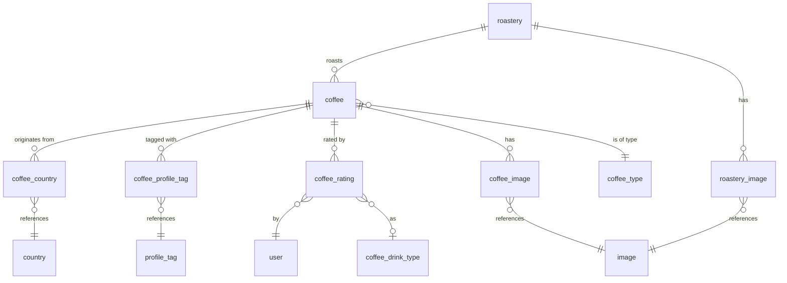
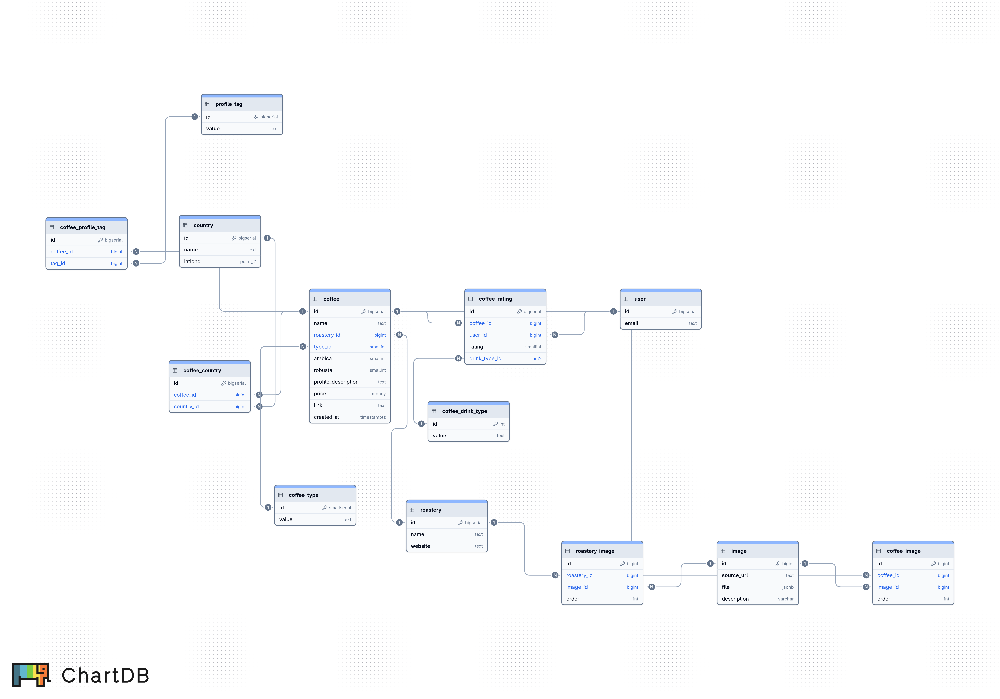

# coffee-diary — DATAMODEL.md

This document describes the database schema managed via Mathesar. It is the single
source of truth for all data available to the coffee-diary API and UI. The database
is read-only from the perspective of this application — all writes happen through
Mathesar.

When the schema changes, this document must be updated accordingly.

---

## ERD

### Mermaid



### Export



---

## Tables

### `roastery`
A coffee roastery that produces one or more coffees.

| Column  | Type   | Notes  |
|---------|--------|--------|
| id      | bigint | PK     |
| name    | text   | —      |
| website | text   | unique |

<details>
<summary>DDL</summary>

```sql
CREATE TABLE public.roastery (
    id bigint NOT NULL,
    name text NOT NULL,
    website text NOT NULL
);

ALTER TABLE ONLY public.roastery
    ADD CONSTRAINT pk_table_2_id PRIMARY KEY (id);
ALTER TABLE ONLY public.roastery
    ADD CONSTRAINT roastery_website_key UNIQUE (website);
```

</details>

---

### `coffee`
The core entity. Represents a specific coffee product from a roastery.

| Column              | Type        | Notes                                 |
|---------------------|-------------|---------------------------------------|
| id                  | bigint      | PK                                    |
| name                | text        | —                                     |
| roastery_id         | bigint      | FK → roastery                         |
| type_id             | smallint    | FK → coffee_type                      |
| arabica             | smallint    | 0–100, must sum to 100 with robusta   |
| robusta             | smallint    | 0–100, must sum to 100 with arabica   |
| profile_description | text        | free-text tasting/profile description |
| price               | money       | price per 250g                        |
| link                | text        | link to product page                  |
| created_at          | timestamptz | defaults to current timestamp         |

<details>
<summary>DDL</summary>

```sql
CREATE TABLE public.coffee (
    id bigint NOT NULL,
    name text NOT NULL,
    roastery_id bigint NOT NULL,
    type_id smallint NOT NULL,
    arabica smallint NOT NULL,
    robusta smallint NOT NULL,
    profile_description text NOT NULL,
    price money NOT NULL,
    link text NOT NULL,
    created_at timestamp with time zone DEFAULT CURRENT_TIMESTAMP NOT NULL,
    CONSTRAINT coffee_arabica_check CHECK (((arabica >= 0) AND (arabica <= 100))),
    CONSTRAINT coffee_arabica_robusta_check CHECK (((arabica + robusta) = 100)),
    CONSTRAINT coffee_robusta_check CHECK (((robusta >= 0) AND (robusta <= 100)))
);

COMMENT ON COLUMN public.coffee.price IS 'for 250g';

ALTER TABLE ONLY public.coffee
    ADD CONSTRAINT pk_table_1_id PRIMARY KEY (id);
ALTER TABLE ONLY public.coffee
    ADD CONSTRAINT fk_coffee_roastery_id_roastery_id FOREIGN KEY (roastery_id) REFERENCES public.roastery(id);
ALTER TABLE ONLY public.coffee
    ADD CONSTRAINT fk_coffee_type_id_coffee_type_id FOREIGN KEY (type_id) REFERENCES public.coffee_type(id);
```

</details>

---

### `coffee_type`
Lookup table for the type of coffee (e.g. espresso, filter, omni-roast).

| Column | Type     | Notes  |
|--------|----------|--------|
| id     | smallint | PK     |
| value  | text     | unique |

<details>
<summary>DDL</summary>

```sql
CREATE TABLE public.coffee_type (
    id smallint NOT NULL,
    value text NOT NULL
);

ALTER TABLE ONLY public.coffee_type
    ADD CONSTRAINT pk_table_8_id PRIMARY KEY (id);
```

</details>

---

### `country`
A country of origin for a coffee.

| Column  | Type   | Notes                    |
|---------|--------|--------------------------|
| id      | bigint | PK                       |
| name    | text   | unique                   |
| latlong | point  | optional geo coordinates |

<details>
<summary>DDL</summary>

```sql
CREATE TABLE public.country (
    id bigint NOT NULL,
    name text NOT NULL,
    latlong point
);

ALTER TABLE ONLY public.country
    ADD CONSTRAINT pk_table_3_id PRIMARY KEY (id);
ALTER TABLE ONLY public.country
    ADD CONSTRAINT country_name_key UNIQUE (name);
```

</details>

---

### `coffee_country`
Many-to-many join between coffee and country. A coffee can have multiple origins.

| Column     | Type   | Notes        |
|------------|--------|--------------|
| id         | bigint | PK           |
| coffee_id  | bigint | FK → coffee  |
| country_id | bigint | FK → country |

Unique constraint on `(coffee_id, country_id)`.

<details>
<summary>DDL</summary>

```sql
CREATE TABLE public.coffee_country (
    id bigint NOT NULL,
    coffee_id bigint NOT NULL,
    country_id bigint NOT NULL
);

ALTER TABLE ONLY public.coffee_country
    ADD CONSTRAINT pk_coffee_country_coffee_id PRIMARY KEY (id);
ALTER TABLE ONLY public.coffee_country
    ADD CONSTRAINT fk_coffee_country_coffee_id_coffee_id FOREIGN KEY (coffee_id) REFERENCES public.coffee(id);
ALTER TABLE ONLY public.coffee_country
    ADD CONSTRAINT fk_coffee_country_country_id_country_id FOREIGN KEY (country_id) REFERENCES public.country(id);

CREATE INDEX coffee_country_index_2 ON public.coffee_country USING btree (country_id);
CREATE UNIQUE INDEX coffee_country_index_3 ON public.coffee_country USING btree (coffee_id, country_id);
```

</details>

---

### `profile_tag`
Lookup table for tasting/profile tags (e.g. "fruity", "chocolate", "floral").

| Column | Type   | Notes  |
|--------|--------|--------|
| id     | bigint | PK     |
| value  | text   | unique |

<details>
<summary>DDL</summary>

```sql
CREATE TABLE public.profile_tag (
    id bigint NOT NULL,
    value text NOT NULL
);

ALTER TABLE ONLY public.profile_tag
    ADD CONSTRAINT pk_table_7_id PRIMARY KEY (id);
ALTER TABLE ONLY public.profile_tag
    ADD CONSTRAINT profile_tag_value_key UNIQUE (value);
```

</details>

---

### `coffee_profile_tag`
Many-to-many join between coffee and profile tags.

| Column    | Type   | Notes            |
|-----------|--------|------------------|
| id        | bigint | PK               |
| coffee_id | bigint | FK → coffee      |
| tag_id    | bigint | FK → profile_tag |

Unique constraint on `(coffee_id, tag_id)`.

<details>
<summary>DDL</summary>

```sql
CREATE TABLE public.coffee_profile_tag (
    id bigint NOT NULL,
    coffee_id bigint NOT NULL,
    tag_id bigint NOT NULL
);

ALTER TABLE ONLY public.coffee_profile_tag
    ADD CONSTRAINT pk_coffee_profile_tag_coffee_id PRIMARY KEY (id);
ALTER TABLE ONLY public.coffee_profile_tag
    ADD CONSTRAINT fk_coffee_profile_tag_coffee_id_coffee_id FOREIGN KEY (coffee_id) REFERENCES public.coffee(id);
ALTER TABLE ONLY public.coffee_profile_tag
    ADD CONSTRAINT fk_coffee_profile_tag_tag_id_profile_tag_id FOREIGN KEY (tag_id) REFERENCES public.profile_tag(id);

CREATE INDEX coffee_profile_tag_index_2 ON public.coffee_profile_tag USING btree (tag_id);
CREATE UNIQUE INDEX coffee_profile_tag_index_3 ON public.coffee_profile_tag USING btree (coffee_id, tag_id);
```

</details>

---

### `coffee_drink_type`
Lookup table for drink types (e.g. espresso, cappuccino, filter). Shared between
ratings and brewing instructions.

| Column | Type | Notes  |
|--------|------|--------|
| id     | int  | PK     |
| value  | text | unique |

<details>
<summary>DDL</summary>

```sql
CREATE TABLE public.coffee_drink_type (
    id integer NOT NULL,
    value text NOT NULL
);

ALTER TABLE ONLY public.coffee_drink_type
    ADD CONSTRAINT coffee_rating_drink_type_pkey PRIMARY KEY (id);
ALTER TABLE ONLY public.coffee_drink_type
    ADD CONSTRAINT coffee_rating_drink_type_value_key UNIQUE (value);
```

</details>

---

### `coffee_rating`
A user's rating for a specific coffee, optionally for a specific drink type.

| Column        | Type     | Notes                           |
|---------------|----------|---------------------------------|
| id            | bigint   | PK                              |
| coffee_id     | bigint   | FK → coffee                     |
| user_id       | bigint   | FK → user                       |
| rating        | smallint | 0–10                            |
| drink_type_id | int      | optional FK → coffee_drink_type |

Unique constraint on `(coffee_id, user_id, drink_type_id)` — one rating per
coffee per user per drink type.

<details>
<summary>DDL</summary>

```sql
CREATE TABLE public.coffee_rating (
    id bigint NOT NULL,
    coffee_id bigint NOT NULL,
    user_id bigint NOT NULL,
    rating smallint NOT NULL,
    drink_type_id integer,
    CONSTRAINT coffee_rating_rating_check CHECK (((rating >= 0) AND (rating <= 10)))
);

ALTER TABLE ONLY public.coffee_rating
    ADD CONSTRAINT pk_table_10_id PRIMARY KEY (id);
ALTER TABLE ONLY public.coffee_rating
    ADD CONSTRAINT coffee_rating_coffee_id_user_id_drink_type_id_key UNIQUE (coffee_id, user_id, drink_type_id);
ALTER TABLE ONLY public.coffee_rating
    ADD CONSTRAINT fk_coffee_rating_coffee_id_coffee_id FOREIGN KEY (coffee_id) REFERENCES public.coffee(id);
ALTER TABLE ONLY public.coffee_rating
    ADD CONSTRAINT fk_coffee_rating_user_id_user_id FOREIGN KEY (user_id) REFERENCES public."user"(id);
ALTER TABLE ONLY public.coffee_rating
    ADD CONSTRAINT coffee_rating_drink_type_id_fkey FOREIGN KEY (drink_type_id) REFERENCES public.coffee_drink_type(id);

CREATE INDEX coffee_rating_index_2 ON public.coffee_rating USING btree (coffee_id);
```

</details>

---

### `user`
A user who can rate coffees. Single-user in practice for v1.

| Column | Type   | Notes  |
|--------|--------|--------|
| id     | bigint | PK     |
| email  | text   | unique |

<details>
<summary>DDL</summary>

```sql
CREATE TABLE public."user" (
    id bigint NOT NULL,
    email text NOT NULL
);

ALTER TABLE ONLY public."user"
    ADD CONSTRAINT pk_table_9_id PRIMARY KEY (id);
ALTER TABLE ONLY public."user"
    ADD CONSTRAINT user_email_key UNIQUE (email);
```

</details>

---

### `image`
Stores image metadata. Used by both coffees and roasteries.

| Column      | Type    | Notes                        |
|-------------|---------|------------------------------|
| id          | bigint  | PK                           |
| source_url  | text    | unique, original URL         |
| file        | jsonb   | unique, stored file metadata |
| description | varchar | —                            |

<details>
<summary>DDL</summary>

```sql
CREATE TABLE public.image (
    id bigint NOT NULL,
    source_url text NOT NULL,
    file jsonb NOT NULL,
    description character varying NOT NULL
);

ALTER TABLE ONLY public.image
    ADD CONSTRAINT image_pkey PRIMARY KEY (id);
ALTER TABLE ONLY public.image
    ADD CONSTRAINT image_source_url_key UNIQUE (source_url);
ALTER TABLE ONLY public.image
    ADD CONSTRAINT image_file_key UNIQUE (file);
```

</details>

---

### `coffee_image`
Join table linking coffees to their images, with display ordering.

| Column    | Type     | Notes       |
|-----------|----------|-------------|
| id        | bigint   | PK          |
| coffee_id | bigint   | FK → coffee |
| image_id  | bigint   | FK → image  |
| order     | smallint | default 0   |

<details>
<summary>DDL</summary>

```sql
CREATE TABLE public.coffee_image (
    id bigint NOT NULL,
    coffee_id bigint NOT NULL,
    image_id bigint NOT NULL,
    "order" smallint DEFAULT '0'::smallint NOT NULL
);

ALTER TABLE ONLY public.coffee_image
    ADD CONSTRAINT coffee_image_pkey PRIMARY KEY (id);
ALTER TABLE ONLY public.coffee_image
    ADD CONSTRAINT coffee_image_coffee_id_fkey FOREIGN KEY (coffee_id) REFERENCES public.coffee(id);
ALTER TABLE ONLY public.coffee_image
    ADD CONSTRAINT coffee_image_image_id_fkey FOREIGN KEY (image_id) REFERENCES public.image(id);
```

</details>

---

### `roastery_image`
Join table linking roasteries to their images, with display ordering.

| Column      | Type     | Notes         |
|-------------|----------|---------------|
| id          | bigint   | PK            |
| roastery_id | bigint   | FK → roastery |
| image_id    | bigint   | FK → image    |
| order       | smallint | default 0     |

<details>
<summary>DDL</summary>

```sql
CREATE TABLE public.roastery_image (
    id bigint NOT NULL,
    roastery_id bigint NOT NULL,
    image_id bigint NOT NULL,
    "order" smallint DEFAULT '0'::smallint NOT NULL
);

ALTER TABLE ONLY public.roastery_image
    ADD CONSTRAINT roastery_image_pkey PRIMARY KEY (id);
ALTER TABLE ONLY public.roastery_image
    ADD CONSTRAINT roastery_image_roastery_id_fkey FOREIGN KEY (roastery_id) REFERENCES public.roastery(id);
ALTER TABLE ONLY public.roastery_image
    ADD CONSTRAINT roastery_image_image_id_fkey FOREIGN KEY (image_id) REFERENCES public.image(id);
```

</details>

---

## Key relationships summary

- A **roastery** produces many **coffees**
- A **coffee** belongs to one **roastery** and one **coffee_type**
- A **coffee** can originate from multiple **countries** (via `coffee_country`)
- A **coffee** can have multiple **profile_tags** (via `coffee_profile_tag`)
- A **coffee** can have multiple **images** (via `coffee_image`)
- A **coffee** can have multiple **ratings** from users (via `coffee_rating`)
- Both **coffees** and **roasteries** share the same **image** table via their
  respective join tables
- **coffee_drink_type** is used optionally in `coffee_rating` to rate a coffee
  in the context of a specific drink type

---

## Full DDL

<details>
<summary>schema.sql</summary>

```sql
CREATE TABLE public.roastery (
    id bigint NOT NULL,
    name text NOT NULL,
    website text NOT NULL
);

CREATE TABLE public.coffee_type (
    id smallint NOT NULL,
    value text NOT NULL
);

CREATE TABLE public.coffee (
    id bigint NOT NULL,
    name text NOT NULL,
    roastery_id bigint NOT NULL,
    type_id smallint NOT NULL,
    arabica smallint NOT NULL,
    robusta smallint NOT NULL,
    profile_description text NOT NULL,
    price money NOT NULL,
    link text NOT NULL,
    created_at timestamp with time zone DEFAULT CURRENT_TIMESTAMP NOT NULL,
    CONSTRAINT coffee_arabica_check CHECK (((arabica >= 0) AND (arabica <= 100))),
    CONSTRAINT coffee_arabica_robusta_check CHECK (((arabica + robusta) = 100)),
    CONSTRAINT coffee_robusta_check CHECK (((robusta >= 0) AND (robusta <= 100)))
);

COMMENT ON COLUMN public.coffee.price IS 'for 250g';

CREATE TABLE public.country (
    id bigint NOT NULL,
    name text NOT NULL,
    latlong point
);

CREATE TABLE public.coffee_country (
    id bigint NOT NULL,
    coffee_id bigint NOT NULL,
    country_id bigint NOT NULL
);

CREATE TABLE public.profile_tag (
    id bigint NOT NULL,
    value text NOT NULL
);

CREATE TABLE public.coffee_profile_tag (
    id bigint NOT NULL,
    coffee_id bigint NOT NULL,
    tag_id bigint NOT NULL
);

CREATE TABLE public.coffee_drink_type (
    id integer NOT NULL,
    value text NOT NULL
);

CREATE TABLE public."user" (
    id bigint NOT NULL,
    email text NOT NULL
);

CREATE TABLE public.coffee_rating (
    id bigint NOT NULL,
    coffee_id bigint NOT NULL,
    user_id bigint NOT NULL,
    rating smallint NOT NULL,
    drink_type_id integer,
    CONSTRAINT coffee_rating_rating_check CHECK (((rating >= 0) AND (rating <= 10)))
);

CREATE TABLE public.image (
    id bigint NOT NULL,
    source_url text NOT NULL,
    file jsonb NOT NULL,
    description character varying NOT NULL
);

CREATE TABLE public.coffee_image (
    id bigint NOT NULL,
    coffee_id bigint NOT NULL,
    image_id bigint NOT NULL,
    "order" smallint DEFAULT '0'::smallint NOT NULL
);

CREATE TABLE public.roastery_image (
    id bigint NOT NULL,
    roastery_id bigint NOT NULL,
    image_id bigint NOT NULL,
    "order" smallint DEFAULT '0'::smallint NOT NULL
);

-- Primary keys
ALTER TABLE ONLY public.roastery ADD CONSTRAINT pk_table_2_id PRIMARY KEY (id);
ALTER TABLE ONLY public.coffee ADD CONSTRAINT pk_table_1_id PRIMARY KEY (id);
ALTER TABLE ONLY public.coffee_type ADD CONSTRAINT pk_table_8_id PRIMARY KEY (id);
ALTER TABLE ONLY public.country ADD CONSTRAINT pk_table_3_id PRIMARY KEY (id);
ALTER TABLE ONLY public.coffee_country ADD CONSTRAINT pk_coffee_country_coffee_id PRIMARY KEY (id);
ALTER TABLE ONLY public.profile_tag ADD CONSTRAINT pk_table_7_id PRIMARY KEY (id);
ALTER TABLE ONLY public.coffee_profile_tag ADD CONSTRAINT pk_coffee_profile_tag_coffee_id PRIMARY KEY (id);
ALTER TABLE ONLY public.coffee_drink_type ADD CONSTRAINT coffee_rating_drink_type_pkey PRIMARY KEY (id);
ALTER TABLE ONLY public."user" ADD CONSTRAINT pk_table_9_id PRIMARY KEY (id);
ALTER TABLE ONLY public.coffee_rating ADD CONSTRAINT pk_table_10_id PRIMARY KEY (id);
ALTER TABLE ONLY public.image ADD CONSTRAINT image_pkey PRIMARY KEY (id);
ALTER TABLE ONLY public.coffee_image ADD CONSTRAINT coffee_image_pkey PRIMARY KEY (id);
ALTER TABLE ONLY public.roastery_image ADD CONSTRAINT roastery_image_pkey PRIMARY KEY (id);

-- Unique constraints
ALTER TABLE ONLY public.roastery ADD CONSTRAINT roastery_website_key UNIQUE (website);
ALTER TABLE ONLY public.country ADD CONSTRAINT country_name_key UNIQUE (name);
ALTER TABLE ONLY public.profile_tag ADD CONSTRAINT profile_tag_value_key UNIQUE (value);
ALTER TABLE ONLY public.coffee_drink_type ADD CONSTRAINT coffee_rating_drink_type_value_key UNIQUE (value);
ALTER TABLE ONLY public."user" ADD CONSTRAINT user_email_key UNIQUE (email);
ALTER TABLE ONLY public.coffee_rating ADD CONSTRAINT coffee_rating_coffee_id_user_id_drink_type_id_key UNIQUE (coffee_id, user_id, drink_type_id);
ALTER TABLE ONLY public.image ADD CONSTRAINT image_source_url_key UNIQUE (source_url);
ALTER TABLE ONLY public.image ADD CONSTRAINT image_file_key UNIQUE (file);

-- Foreign keys
ALTER TABLE ONLY public.coffee ADD CONSTRAINT fk_coffee_roastery_id_roastery_id FOREIGN KEY (roastery_id) REFERENCES public.roastery(id);
ALTER TABLE ONLY public.coffee ADD CONSTRAINT fk_coffee_type_id_coffee_type_id FOREIGN KEY (type_id) REFERENCES public.coffee_type(id);
ALTER TABLE ONLY public.coffee_country ADD CONSTRAINT fk_coffee_country_coffee_id_coffee_id FOREIGN KEY (coffee_id) REFERENCES public.coffee(id);
ALTER TABLE ONLY public.coffee_country ADD CONSTRAINT fk_coffee_country_country_id_country_id FOREIGN KEY (country_id) REFERENCES public.country(id);
ALTER TABLE ONLY public.coffee_profile_tag ADD CONSTRAINT fk_coffee_profile_tag_coffee_id_coffee_id FOREIGN KEY (coffee_id) REFERENCES public.coffee(id);
ALTER TABLE ONLY public.coffee_profile_tag ADD CONSTRAINT fk_coffee_profile_tag_tag_id_profile_tag_id FOREIGN KEY (tag_id) REFERENCES public.profile_tag(id);
ALTER TABLE ONLY public.coffee_rating ADD CONSTRAINT fk_coffee_rating_coffee_id_coffee_id FOREIGN KEY (coffee_id) REFERENCES public.coffee(id);
ALTER TABLE ONLY public.coffee_rating ADD CONSTRAINT fk_coffee_rating_user_id_user_id FOREIGN KEY (user_id) REFERENCES public."user"(id);
ALTER TABLE ONLY public.coffee_rating ADD CONSTRAINT coffee_rating_drink_type_id_fkey FOREIGN KEY (drink_type_id) REFERENCES public.coffee_drink_type(id);
ALTER TABLE ONLY public.coffee_image ADD CONSTRAINT coffee_image_coffee_id_fkey FOREIGN KEY (coffee_id) REFERENCES public.coffee(id);
ALTER TABLE ONLY public.coffee_image ADD CONSTRAINT coffee_image_image_id_fkey FOREIGN KEY (image_id) REFERENCES public.image(id);
ALTER TABLE ONLY public.roastery_image ADD CONSTRAINT roastery_image_roastery_id_fkey FOREIGN KEY (roastery_id) REFERENCES public.roastery(id);
ALTER TABLE ONLY public.roastery_image ADD CONSTRAINT roastery_image_image_id_fkey FOREIGN KEY (image_id) REFERENCES public.image(id);

-- Indexes
CREATE INDEX coffee_country_index_2 ON public.coffee_country USING btree (country_id);
CREATE UNIQUE INDEX coffee_country_index_3 ON public.coffee_country USING btree (coffee_id, country_id);
CREATE INDEX coffee_profile_tag_index_2 ON public.coffee_profile_tag USING btree (tag_id);
CREATE UNIQUE INDEX coffee_profile_tag_index_3 ON public.coffee_profile_tag USING btree (coffee_id, tag_id);
CREATE INDEX coffee_rating_index_2 ON public.coffee_rating USING btree (coffee_id);
CREATE UNIQUE INDEX coffee_profile_tag_coffee_profile_tag_index_3 ON public.coffee_profile_tag USING btree (coffee_id, tag_id);
```

</details>